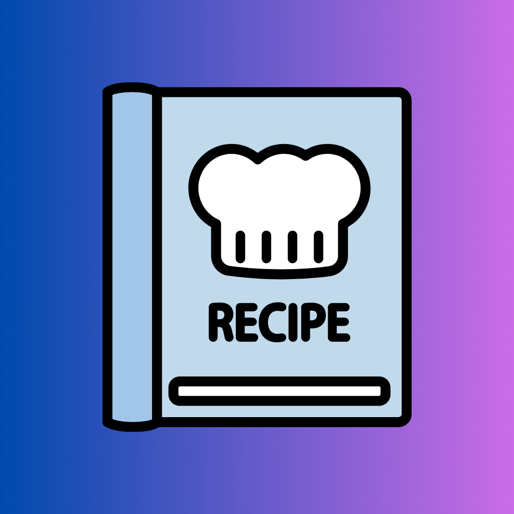
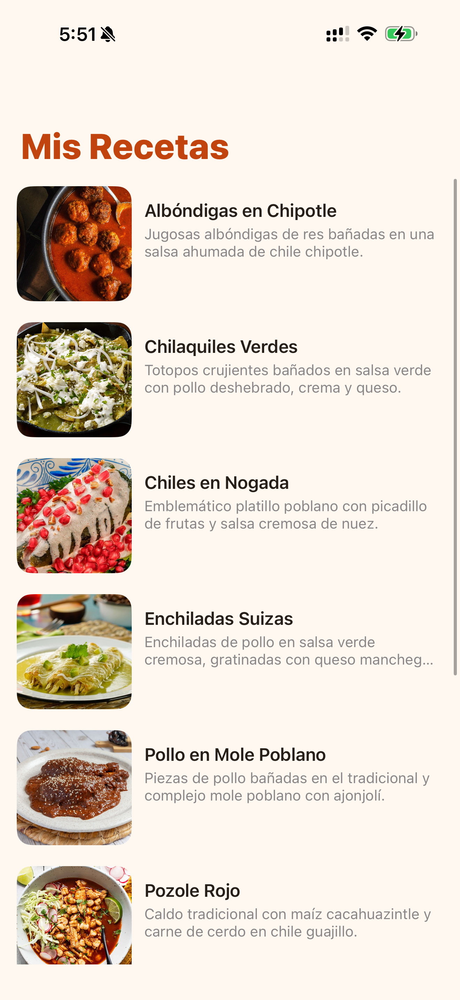
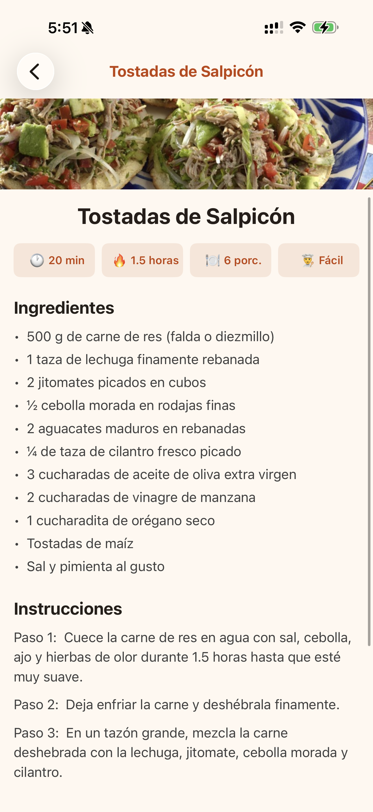

  
  <h1>Mis Recetas Favoritas 👨‍🍳🌮</h1>
  
<strong>Una experiencia premium y minimalista para explorar la auténtica gastronomía mexicana.</strong>

  
  
  
  

---

## 📱 Acerca del Proyecto

**Mis Recetas Favoritas** es una aplicación nativa para iOS desarrollada completamente en Swift utilizando UIKit y Storyboards. Ha sido diseñada con un enfoque absoluto en la **experiencia de usuario (UX)** y una **interfaz visual impecable**, destacando habilidades sólidas en el desarrollo frontend móvil, estilización y patrones de diseño de Apple.

Orientada a cautivar desde el primer momento, la aplicación presenta un estilo visual cálido inspirado en la cultura mexicana, logrando un balance perfecto entre estética y funcionalidad.

---

## 🎥 Demo de la Aplicación

  
   
  
<i>Haz clic en la imagen en miniatura para ver el video demostrativo de la navegación y UI.</i>

---

## ✨ Características Destacadas

* **Diseño Premium y Minimalista**: Paleta de colores cálida (terracota y crema) con jerarquía visual clara, bordes redondeados y tipografía moderna y contrastante.
* **Navegación Fluida**: Implementación de `UINavigationController` con *Large Titles* translúcidos y transiciones elegantes entre el catálogo y las vistas de detalle.
* **Micro-interacciones y UI Avanzada**:
  * Celdas de `UITableView` construidas con márgenes internos para un efecto de tarjeta moderna.
  * Animaciones táctiles tipo *spring* al presionar elementos, brindando excelente feedback visual.
  * Efectos *fade-in* progresivos al cargar la lista de recetas.
* **Modelo de Datos Estructurado**: Estructuras (`Structs`) detalladas con múltiples propiedades de metadata (tiempos de preparación, dificultad, porciones, instrucciones numeradas paso a paso).

---

## 📸 Screenshots

  
  &nbsp;&nbsp;&nbsp;&nbsp;&nbsp;&nbsp;
  

---

## 🛠 Tecnologías y Herramientas

* **Lenguaje:** Swift 5
* **Framework Principal:** UIKit
* **Interfaz Gráfica:** Storyboards & AutoLayout (Programático e Interface Builder)
* **Arquitectura:** MVC (Model-View-Controller)
* **Componentes Principales:** `UITableView`, `UIStackView`, `UIScrollView`, `UINavigationController`
* **Animaciones:** Core Animation y UIView Animations (Spring Damping)
* **Entorno de Desarrollo:** Xcode

---

  <i>Desarrollado con mucha dedicación para brindar la mejor experiencia nativa en iOS.</i>

